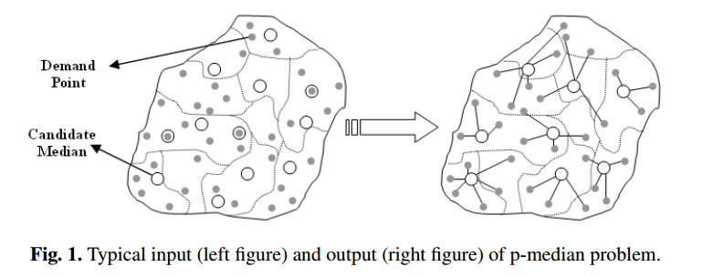

# Ant-Colony Optimization for the Capacitated P-Medians Problem

### Description  

This work is an implementation of the algorithm proposed by [de França et al. 2005](http://www.informatica.si/index.php/informatica/article/view/29), which is an Ant Colony Optimization based approach for solving the Capacitated P-Medians Problem.  

The Capacitated P-Medians Problem can be defined as follows: given a graph G=(V,E), in which each vertex v has a pair of numbers (c, d) associated to it, representing the vertex's capacity and demand, select P vertices to act as providers (centers), and allocate the remaining vertices (consumers) to these centers, so that the capacity of the centers is able to supply the demands of the consumers.  

This picture, found in [this paper](https://pdfs.semanticscholar.org/a155/9fd3eb202a56d14db6ae198bbdade0722f09.pdf) by Ghoseiri K. and Ghannadpour S.F., illustrates the concept presented above:  
  


### Implementation  

This work was implemented in _Python_ using _numpy_ to represent the graph and to perform operations in it.  

### Dependencies  

To install the dependencies necessary to run this code, just run the commands below in your system:

```  
pip install -r requirements.txt  
```  

### Usage  

```bash  
cd src  
./main.py -a, --alpha [ALPHA] -b, --beta [BETA] -p, --ro [Rho(pheromone decay rate)] -i, --iterations [ITERATIONS] -an, --ants [POPULATION_SIZE] -s, --seed [SEED] input_filename
```  

Terms between brackets must be replaced by adequate parameters. The list of parameters and their domains is the following:  

* -a, --alpha [float] (default: 3.0) This parameter sets the value of the alpha, used in the probabilistic transition function on the ACO. The value of alpha determines the importance of the memory factor in the transition of an ant.  
* -b, --beta [float] (default: 1.0) This parameter sets the value of the beta, used in the probabilistic transition function on the ACO. The value of beta determines the importance of the node visibility (neighborhood) in the transition of an ant.  
* -p, --ro [float] (default: 0.5) This parameter sets the value of Rho, used to update the pheromone trail left in the nodes at each iteration.  
* -i, --iterations [int] (default: 10) This parameter sets the maximum number of iterations that the algorithm will perform.  
* -an, --ants [int] (default: 10) This parameter sets the number of ants in the colony.  
* --seed [int] (default: 1) This parameter sets the random seed used in the program.  
* input_filename [str] This parameter is mandatory, and represents the path to the program's input file  

### References  

* __Ghoseiri K. and Ghannadpour S.F.__, _An efficient heuristic method for capacitated P-Median problem_, International Journal of Management Science and Engineering Management (2009) [[1]](https://pdfs.semanticscholar.org/a155/9fd3eb202a56d14db6ae198bbdade0722f09.pdf)  
* __de França et. al.__, _Max Min Ant System and Capacitated P-Medians: Extensions and Improved Solutions_, Informatica (2005) [[2]](http://www.informatica.si/index.php/informatica/article/view/29)
