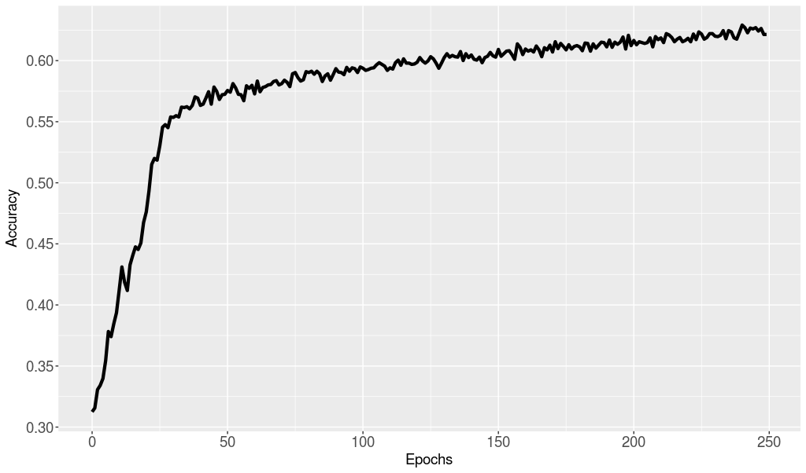
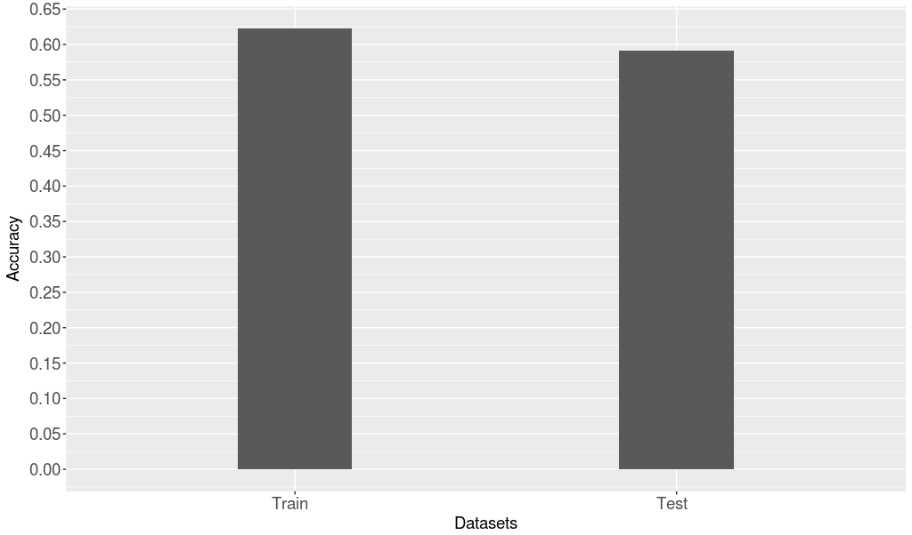

# Protein Placement Using Neural Networks  

### Description  

This work consists in a Neural Networks based algorithm for solving a supervised learning problem, which's goal is to find protein placement in cells. A protein can be located in one of 7 places: cytoplasm (CYT), mitochondria (MIT), 3 different cell membrane parts (ME1, ME2, ME3), or outside of the cell (EXC).  

The training dataset contained 1429 labeled examples, each one with 8 attributes. We use a _3-fold cross-validation_ approach to train a model on the input dataset. We built a 3-layered MLP (_Multi-Layer Perceptron_). The hidden layer contained 16 neurons, each using _ReLU_ as activation function. The output layer's activation function was _Softmax_. The cost function used was _Categorical Cross-Entropy_, and the training was done using _Mini-Batch Gradient Descent_ with a batch size of 32 examples. The training stage was done using _3-fold Cross Validation_, to avoid overfitting the model.   

### Implementation   

This work was implemented in _Python_, using _Keras_ with _TensorFlow_ as backend as Neural Networks library .   

### Dependencies  

To install the dependencies necessary to run this code, just run the commands below in your system:

```  
pip install -r requirements.txt  
```  

### Usage  

```bash  
cd src  
./main.py -n [NEURONS] --hidden [HIDDEN] -a, –activation [ACTIVATION] -e, --epochs [EPOCHS] -b, --batch [BATCH] -d, --decay [DECAY] -s, --seed [SEED]
input_filename output_filename  
```  

Terms between brackets must be replaced by adequate parameters. The list of parameters and their domains is the following:  

* -n, --neurons [int] (default: 8) This parameter sets the number of neurons in each hidden layer
* --hidden [int] (default: 1) This parameter sets the number of hidden layers in the network
* -a, --activation [’relu’, ’sigmoid’, ’softmax’] (default: ’relu’) This parameter sets the activaction function used in the neurons
* -e, --epochs [int] (default: 100) This parameter sets the number of epochs for the training phase
* -b, --batch [int] (default: 10) This parameter sets the batch size given to the network in each epoch (Mini-Batch Gradient Descent)
* -lr, --learning-rate [float] (default: 0.1) This parameter sets the learning rate of the network
* -d, --decay [float] (default: 0.00005) This parameter sets a decay value for the network's learning rate
* --seed [int] (default: 1) This parameter sets the program's random seed
* input_filename [str] This parameter is mandatory, and represents the path to the program's input file
* output_filename [str] This parameter is mandatory, and represents the path to the program's input file

### Results  

The results showed that after 250 epochs in training phase, an accuracy of 62% was achieved. This model, applied to validation data, obtained an accuracy of 58%.   

Train accuracy across epochs:  
  

Train accuracy vs test accuracy:  
  

