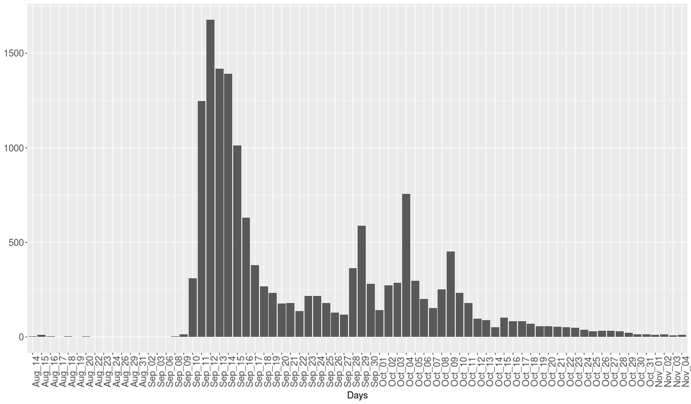
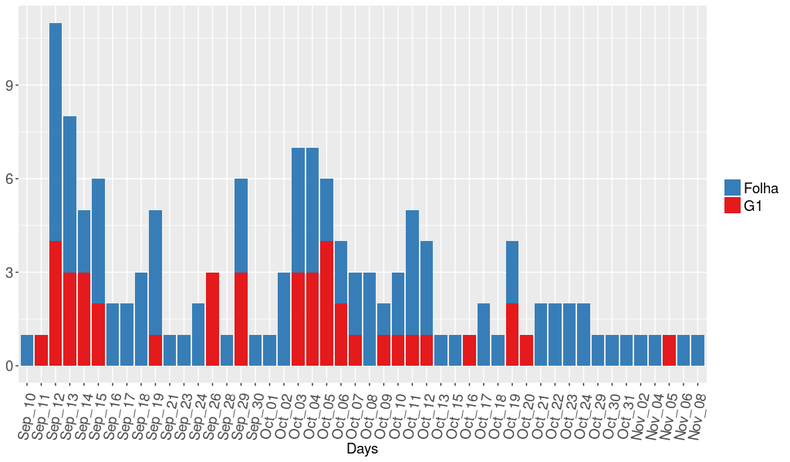
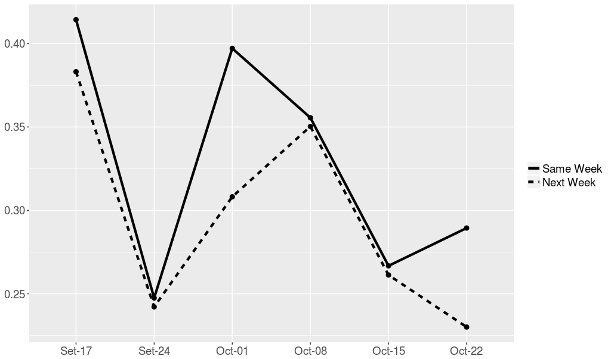
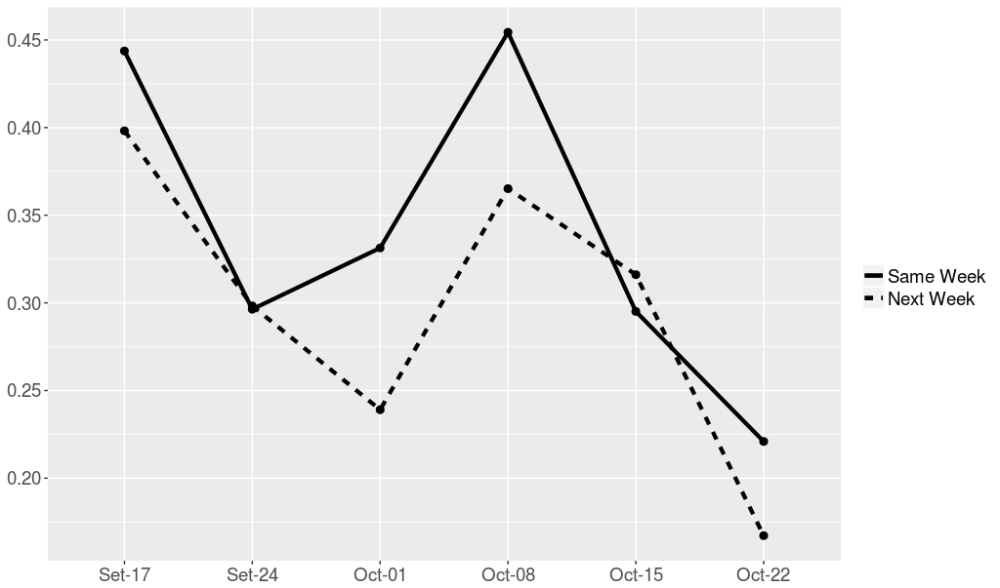
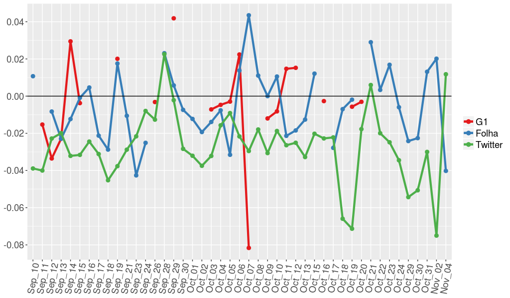

# Social Computing  
### Description  
This repository holds the code used in the Social Computing project. The project's goal was to collect a dataset, preferrably from social media, related to a public event and analyze it, using data science tools.  

We analyze tweets and news about the closing of the "Queermuseu" art exhibit in Porto Alegre, Brazil. This was a very popular event, which had repercussions in almost every social network across the world. The goal of this project was to identify similarities between texts posted on social networks and popular news media streams.  

### Methodology  

The tweets were collected using [GetOldTweetspython](https://github.com/Jefferson-Henrique/GetOldTweets-python). We searched for the term 'queermuseu' and collected every tweet containing this expression. In total, we obtained a sample of 15558 tweets, from several users across the world. The image below presents the distribution of tweets over the days in the analysis.  

Daily distribution of tweets:
  

The news pieces were collected using a web-scraper develop by us. It scrapes two very popular news media websites in Brazil: Folha de São Paulo and G1, and collects any article containing the term 'queermuseu'. In total, 91 articles were collected from Folha de São Paulo, and 44 from G1. The articles followed the daily distribution presented below. 

Daily distribution of news:
  

In order to measure the similarity between social media texts and news media texts, we used three approaches: cosine similarity and sentiment analysis. More info on the methods will be presented on [Results](### Results).  

### Dependencies  
* Python Beautifulsoup4  
`sudo pip install beautifulsoup4`  
* Python Selenium (and Firefox geckodriver)  
`sudo pip install --upgrade selenium`  
`wget https://github.com/mozilla/geckodriver/releases/download/v0.19.0/geckodriver-v0.19.0-linux64.tar.gz`  
`mv geckodriver /opt`  
`echo "export PATH=$PATH:/opt/geckodriver" >> ~/.bashrc`  

Another option is to just import the requirements via file:  
```bash  
pip install -r requirements.txt  
```  
This will import the dependencies required to run the code.
### Important Remarks  

* The BeautifulSoup library is used for parsing and manipulating DOM elements on loaded pages  
* The Selenium library (along with geckodriver) is used to load complete pages when the usual HTTPRequest is not enough (when needed information is added dinamically to the page through onLoad() methods in JavaScript)  

### Results  

#### Cosine Similarity  
We used the consine similarity as a text similarity metric for social media and news media texts. We calculated the values for texts written in the same week, and text written on week apart (specifically, news media texts written on the week in question, and tweets from the following week). The results can be seen on the graph below, the X axis represent weeks and the Y axis is the similarity percentage, in the scale [0,1].  

Cosine similarity between Tweets and articles from Folha de São Paulo:  
  

Cosine similarity between Tweets and articles from G1:  
  

We can see that the texts are fairly similar, reaching up to 45% of similarity for G1 and 40% for Folha. The similarity between texts written in different weeks tend to be smaller than texts written in the same week.  

In order to calculate the cosine similarities we used the [TFIDVectorizer](http://scikit-learn.org/stable/modules/generated/sklearn.feature_extraction.text.TfidfVectorizer.html) tool from _Python's_ [scikit-learn](http://scikit-learn.org/stable/index.html) library.  

#### Sentiment Analysis

We used sentiment analysis as a tool for visualizing the sentiment trend between news articles and tweets about the event. We calculated a polarity value, in the range [-1,1], -1 being totally negative, 1 being totally positive, and 0 being neutral. We plotted these values on a daily scale and compared the news values with the tweets. The graph below presents the results. The Y axis represents the polarity values, and the X axis represents the days in our analysis. We placed a reference line in 0 so the reader can clearly see the shift between a negative feeling and a positive one, and _vice-versa_.  

  

We can see that both tweets and news were fairly neutral about the event, because the curves stay very close to the 0 reference line (maximum deviation under 1%). The tweets were mostly negative, passing the 0 line only twice.  

In order to calculate the polarity of texts, we used [polyglot](https://github.com/aboSamoor/polyglot), an NLP toolkit for _Python_.  
